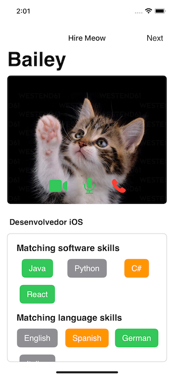
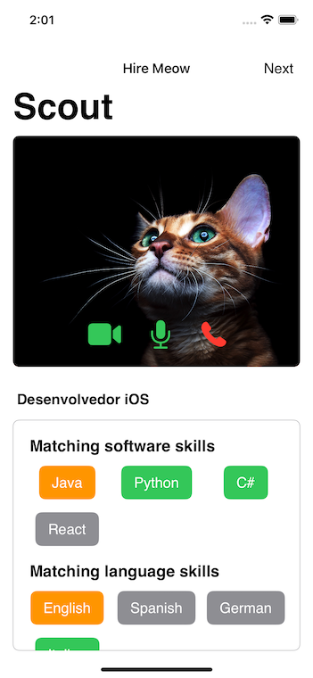

# The challenge
By: SheSharp https://www.shesharp.co/hackathon-2023 

**Unleash your creativity and build something amazing with job postings data and APIs 👩‍💻✨**

Let’s explore together the potential of job postings data and APIs to craft creative and empowering projects!

As part of this Hackathon Coding Jam, we will give you access to job postings APIs and data from companies worldwide. You'll have the opportunity to develop a project that could potentially empower SheSharp community members with valuable tools, insights, and information.

The job posting data and APIs to be used during the hackathon is kindly provided by **[SourceStack](https://sourcestack.co/).**

# The proposal
## Hire Meow

The project is an App for recruiters who can FaceTime with their candidates. While the candidate is on the call, a summary of the current jobOpening and their matching skills will show-up in the screen. 

To remove gender-bias, the App will add a filter to the actual person being interviewed. The filters are cute little kittens! The name and surname of the candidates are hidden and only a nickname will show.

## Notes
- I've used **Xcode Version 15.0 beta**
- The API wasn't reachable (limit's exeeded) so at some point we switched to use a local JSON. Both approaches are left in the code
- We had short time to code! So of course tons of improvements can be done

## Screenshots

## Video - MOV

## Video - GIF
